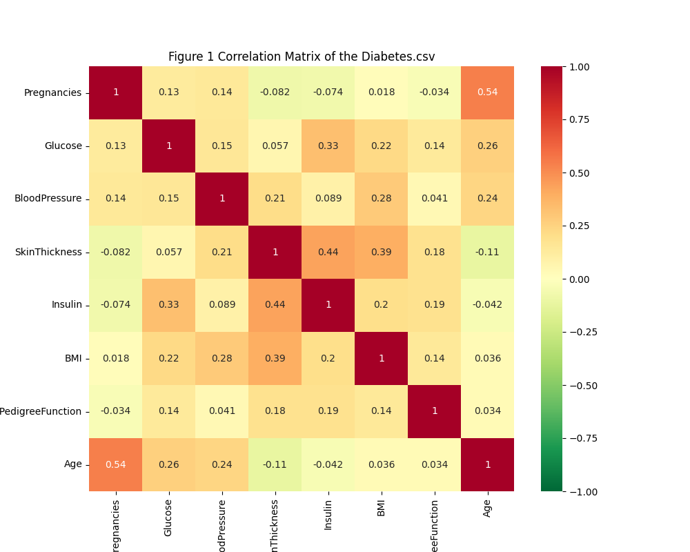
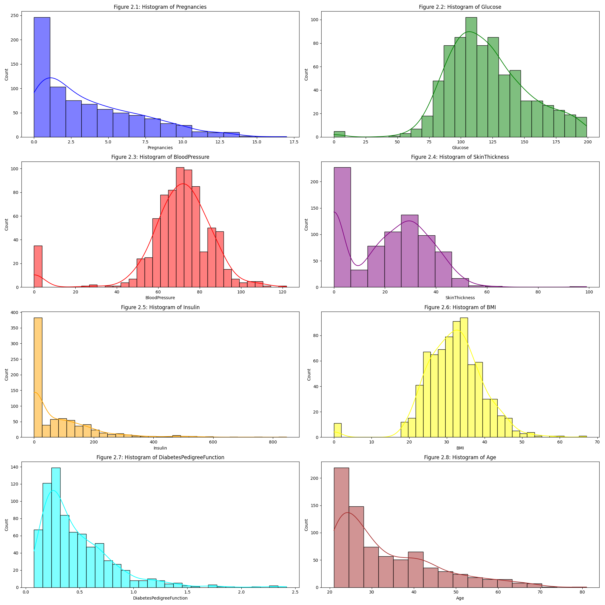
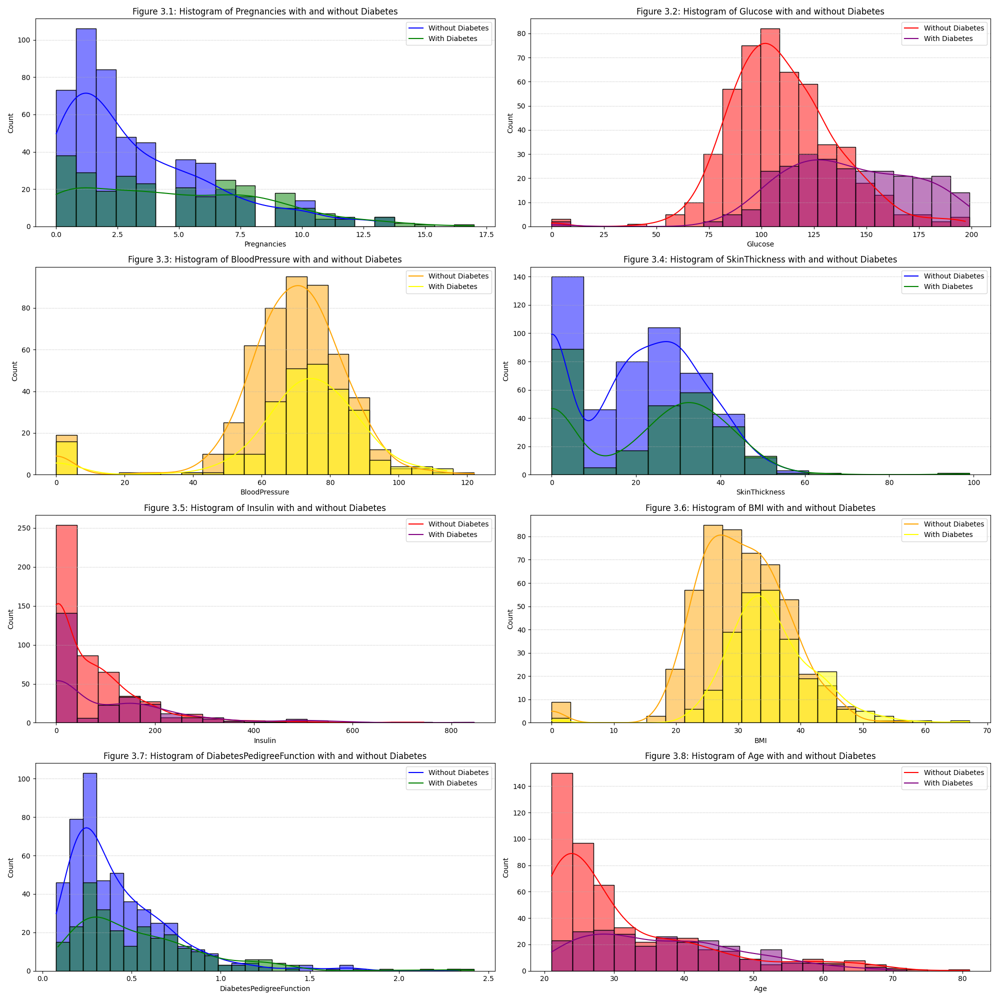
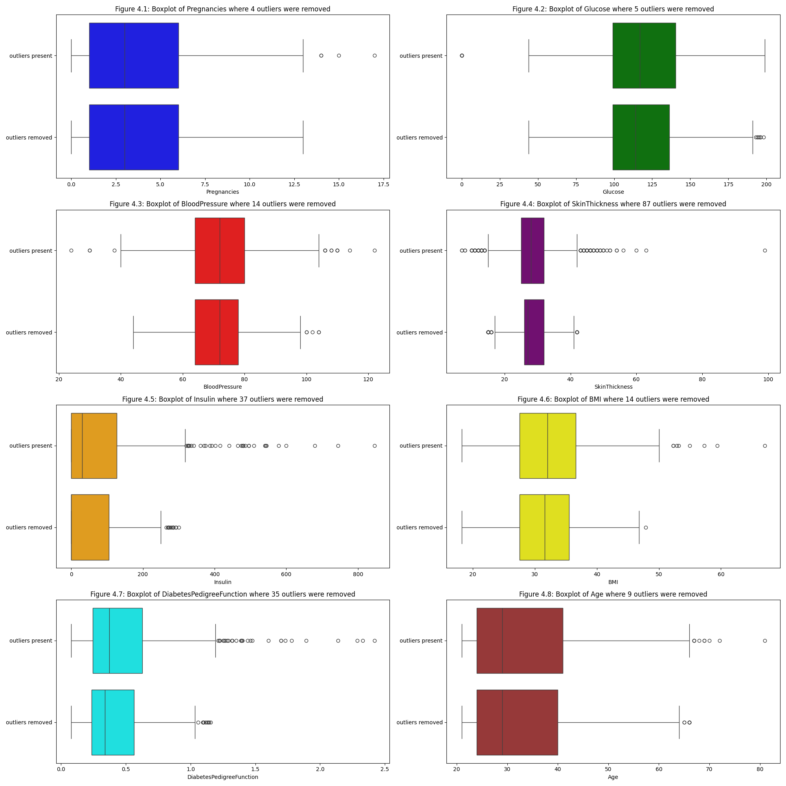
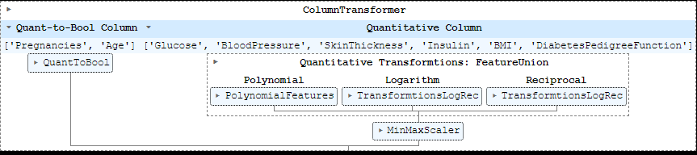
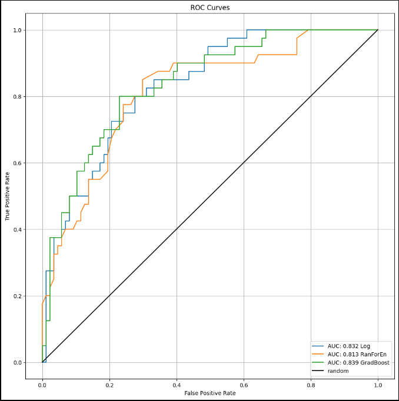

# Overview: Supervised Learning Project 

-This project aims to create a model to predict whether someone may be diabetic.  The data for the project is the diabetes.csv, where the boolean outcome column serves as the basis of the supervised logistic regression model. 

This dataset is originally from the National Institute of Diabetes and Digestive and Kidney
Diseases. The objective of the dataset is to predict whether a patient has diabetes,
based on certain diagnostic measurements included in the dataset. 

[Kaggle Dataset](https://www.kaggle.com/datasets/akshaydattatraykhare/diabetes-dataset)

# Procedure

## Part I Exploratory Data Analysis

### Understanding the desired model

### Understanding the variables 

### Assessing a correlation matrix to assess multicolinearity (interaction effect)

### Assessing histogram distributions

### Assessing histograms based on outcome (with or without diabetes)

## Part II : Preprocessing & Feature Engineering

### Handling missing values, where 273 values were imputed in the BMI, BloodPressure, and SkinThickness columns

### Handling Outliers

### Preprocessing Columns

Where the Quant to Bool is by threshold, where above 0 pregnancies and above age 34 are considered "True"
Where the Quantitative values were transformed (original columns kept) to the quadratic, the interaction values, the reciprocal, and the logarithm, then put through a minmaxscaler from 0 to 1.

### Spliting into a training and testing dataset
The quantitative columns of age and pregnancy were removed (the boolean columns remain)
The dataset was split based on the stratified Y outcome variable to reduce the impact of imbalanced data.

## Part III : Training ML Model

### Scoring
Considering our data is imbalanced and it is imperative to have a high sensitivity due to the nature of medical diagnosis, the metric I will be using is a weighted sum between recall (0.7) and the f1-score (0.3).  A model and the features to select will be based on this highest weighted sum. The recall will return a high rate of true positives but shouldn't be completely fixated on the records of positive cases in the training data.  Therefore, F1-score is put into the mix to balance the selection of features and models. 

### Ensemble Methods
Bagging Ensemble using Logistic Regression Model_
Random Forest and Gradient Boosting Ensembles using Decision Trees

### Specifying Modeling Definitions
The model will absolutely include "Glucose", "BloodPressure", "SkinThickness", "Insulin", "BMI", "DiabetesPedigreeFunction" as features

### Feature Selection
The method used is the ExhaustiveFeature Selector

### Model Hypertuning
Grid Search for each of the 3 ensemble methods given best features

### Model Evaluation
accuracy, precision, recall, F1-score, and ROC-AUC

# Results
Given that we would want the highest recall score, I would be going with the Gradient Boost Model, which also has the highest F Score.  It is also closest to the top left of the ROC chart.

# Conclusion
1. Considering the Histograms, glucose showed the greatest amount of change between those with and those without diabetes.
2. Hospitals and medical professionals could use this model to predict the early stages of diabetes of their current patients.
3. Data from other hospitals using the same metrics could be sourced and fed into this model to increase its predictive power.

